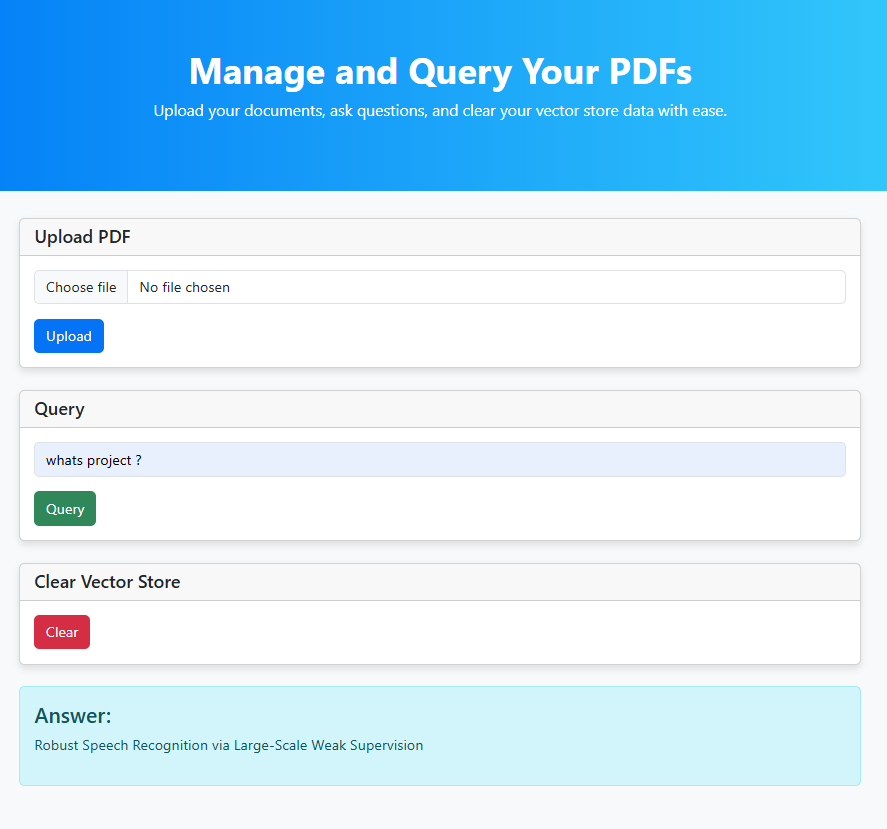

# PDF Chat RAG Application

A Retrieval Augmented Generation (RAG) application that allows users to chat with their PDF documents. Upload a PDF and ask questions about its content to get accurate, contextual answers.



## Features

- PDF document upload and processing
- Text extraction and chunking
- Vector embeddings generation using Hugging Face models
- Semantic search using FAISS vector database
- Question answering with transformer-based models
- GPU acceleration support for faster processing
- Simple web interface

## Technology Stack

- **FastAPI**: Web framework for building the API
- **Langchain**: Framework for developing applications powered by language models
- **Hugging Face Transformers**: For question-answering pipeline and embeddings
- **FAISS**: Vector similarity search for efficient retrieval
- **PyPDF2**: PDF text extraction
- **Jinja2**: HTML templating
- **Torch**: Deep learning framework with GPU support

## Prerequisites

- Python 3.10

## Installation

1. Clone the repository:
```bash
git clone https://github.com/tahsinsoyak/rag-pdf-chat-app-hf.git
cd rag-pdf-chat-app-hf
```

2. Install the required dependencies:
```bash
pip install -r requirements.txt
```

3. Make sure you have a working environment with PyTorch installed. GPU support is optional but recommended for faster processing.

## Usage

1. Start the application:
```bash
python main.py
```

2. Open your browser and navigate to `http://localhost:8000`

3. Upload a PDF document using the interface

4. Ask questions about the document content in the query box

5. Clear the document store when you want to start fresh

## How It Works

This application implements a Retrieval Augmented Generation (RAG) architecture:

1. **Document Processing**: PDFs are uploaded, text is extracted and split into manageable chunks
   
2. **Embedding Generation**: Each text chunk is converted into a vector embedding using the Hugging Face model "sentence-transformers/all-MiniLM-L6-v2"
   
3. **Vector Storage**: Embeddings are stored in a FAISS vector database for efficient similarity search
   
4. **Retrieval**: When a question is asked, the system retrieves the most relevant text chunks based on semantic similarity
   
5. **Question Answering**: A RoBERTa-based model processes each relevant chunk to generate the best answer
   
6. **Response**: The answer with the highest confidence score is presented to the user

## API Endpoints

- `GET /`: Main application interface
- `POST /upload/`: Upload and process PDF files
- `POST /query/`: Submit questions about uploaded documents
- `POST /clear/`: Clear the current vector store

## Performance Notes

- GPU acceleration is automatically used if available, significantly improving processing speed
- For larger documents, the chunking parameters can be adjusted in the code
